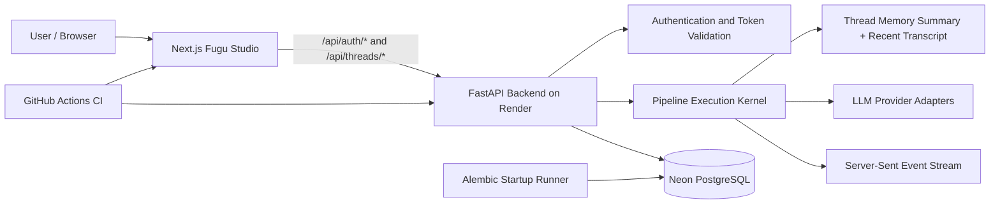

# Fugu System

[](https://github.com/shravanprassadh/fugu-system/actions/workflows/ci.yml)

Fugu System is a modular full-stack prototype for authenticated AI pipeline execution. It combines a FastAPI backend, a PostgreSQL/Neon data layer, Alembic-managed migrations, and a Next.js Studio interface into one deployable system.

Users authenticate, work inside owned conversation threads, submit prompts to an execution pipeline, and receive streamed Server-Sent Events while the system persists users, threads, messages, provider credentials, pipeline definitions, memory summaries, and run history.

The active deployment path is:

- **Frontend:** Vercel
- **Backend:** Render
- **Database:** Neon PostgreSQL
- **CI:** GitHub Actions

## Core capabilities

- Authenticated Studio access with username/password login and bearer tokens.
- Owned conversation threads with create, rename, delete, and persisted message history.
- Streaming pipeline execution over Server-Sent Events.
- Pluggable provider adapters and encrypted provider credentials.
- Durable thread-memory summaries combined with a bounded recent transcript.
- Safe markdown rendering that never interprets raw HTML.
- Async SQLAlchemy 2 data access with explicit database routing.
- Alembic migrations applied at backend startup behind a PostgreSQL advisory lock.
- Production-oriented CI covering secret scanning, backend validation, frontend validation, dependency audits, and container checks.

## System architecture



## Repository layout

```text
.
├── backend/                 # FastAPI backend, models, migrations, execution kernel, tests
├── frontend/                # Next.js Studio UI
├── docs/                    # Deployment and operating runbooks
├── .github/workflows/       # CI workflows
├── .github/BRANCH_PROTECTION.md
└── .env.example             # Environment variable template
```

## Thread memory model

Fugu uses a two-layer handoff format when building provider prompts:

1. **Thread memory summary**
   - Durable, AI-oriented context generated from earlier conversation history.
   - Designed to preserve decisions, constraints, unresolved work, and relevant state.
   - Independently bounded to prevent prompt growth.

2. **Recent raw transcript**
   - A bounded window of the most recent messages.
   - Preserves exact wording and immediate conversational context.
   - Older messages outside the configured window are excluded.

The final provider prompt is ordered as:

```text
[Thread memory summary]
...

[Recent raw transcript]
...

[Current user request]
...
```

Both memory sections use tail-preserving truncation so the most recent and operationally relevant content survives when limits are exceeded. Tests verify section presence, ordering, bounds, truncation behaviour, exclusion of old messages, and removal of the retired `[Recent thread memory]` format.

## Backend API surface

The backend intentionally does **not** expose a root `/` route. A `404 Not Found` at the Render root URL does not mean the service is unavailable.

| Method | Route | Purpose |
| --- | --- | --- |
| `GET` | `/api/health/live` | Process liveness check |
| `GET` | `/api/health/ready` | Database-backed readiness check |
| `GET` | `/api/docs` | Swagger/OpenAPI documentation |
| `POST` | `/api/auth/login` | Username/password login |
| `GET` | `/api/auth/me` | Current authenticated profile |
| `POST` | `/api/auth/logout` | Revoke active tokens for the user |
| `GET` | `/api/threads` | List owned threads |
| `POST` | `/api/threads` | Create a thread |
| `GET` | `/api/threads/{thread_id}/messages` | Load message history |
| `PATCH` | `/api/threads/{thread_id}` | Rename a thread |
| `DELETE` | `/api/threads/{thread_id}` | Delete a thread and its history |
| `POST` | `/api/threads/{thread_id}/execute` | Execute the pipeline and stream SSE events |

## Deployment model

| Layer | Service | Notes |
| --- | --- | --- |
| Frontend | Vercel | Builds `frontend/`; public API origin is compiled into the build |
| Backend | Render | Runs `bash ./entrypoint.sh`; applies migrations before Uvicorn starts |
| Database | Neon PostgreSQL | Used by runtime pools and Alembic |
| CI/CD | GitHub Actions | Required gate for security, backend, frontend, and container validation |

Detailed deployment instructions are in [`docs/DEPLOYMENT.md`](docs/DEPLOYMENT.md).

## Critical environment variables

### Render backend

```text
RUNTIME_ENVIRONMENT=production
MASTER_ROUTER_DB_URL=postgresql://...
METADATA_SIDEBAR_DB_URL=postgresql://...
TRANSACTIONAL_LOGS_DB_URL=postgresql://...
SYSTEM_SESSION_SECRET=<at-least-32-characters>
VAULT_ENCRYPTION_KEY=<fernet-key>
ALLOWED_ORIGINS=https://your-vercel-app.vercel.app
RUN_MIGRATIONS=true
VERIFY_DATABASES_ON_STARTUP=true
```

### Vercel frontend

```text
NEXT_PUBLIC_FUGU_API_BASE_URL=https://your-render-backend.onrender.com
```

Do not append `/api`. The frontend already calls `/api/...` paths internally.

After changing `NEXT_PUBLIC_FUGU_API_BASE_URL`, redeploy the frontend because public Next.js environment variables are compiled into the build.

## First admin user

A fresh database has no default user.

When a backend shell is available:

```bash
fugu-create-user --username admin --role admin
```

Render Free does not provide a service shell. Use the Neon SQL bootstrap procedure in [`docs/DEPLOYMENT.md`](docs/DEPLOYMENT.md#first-admin-user) instead. Never commit bootstrap passwords or password hashes.

## Pipeline and provider bootstrap

A fresh database has no pipeline definition and no provider credentials.

```bash
# Seed the default pipeline
fugu-seed-pipeline --provider openrouter --model anthropic/claude-sonnet-4-5

# Encrypt and store a provider API key
FUGU_PROVIDER_SECRET="sk-or-..." fugu-set-provider-credential --provider openrouter
```

`fugu-seed-pipeline` validates the provider, resolves the DAG before writing, and refuses to overwrite an existing definition unless `--replace` is supplied. Provider credentials are encrypted through the runtime vault and rotated in place.

## Local development

### Backend

```bash
cd backend
python -m venv .venv
source .venv/bin/activate
python -m pip install -r requirements.txt
python -m pytest
```

Validation commands:

```bash
python -m ruff format --check src tests
python -m ruff check src tests
python -m mypy src
python -m pip_audit --requirement requirements.txt --strict
```

### Frontend

```bash
cd frontend
npm ci
npm run dev
```

Validation commands:

```bash
npm run lint
npm exec vitest -- run
npm audit --audit-level=high
npm run build
```

## CI and contribution workflow

The required GitHub Actions gate validates:

- repository secret hygiene,
- backend formatting, linting, strict typing, tests, and dependency audit,
- frontend linting, tests, dependency audit, and production build,
- production backend container and runtime behaviour.

All changes should follow this workflow:

1. Create a feature or maintenance branch from `main`.
2. Commit changes to that branch.
3. Open a pull request into `main`.
4. Wait for **Required CI Gate** to pass.
5. Merge through the pull request.

Do not push directly to `main`. Push-triggered CI can report failures, but it cannot prevent a direct push unless branch protection or a repository ruleset is enabled.

The expected protection policy is documented in [`.github/BRANCH_PROTECTION.md`](.github/BRANCH_PROTECTION.md).

## Common operational checks

### Backend root shows `Not Found`

Expected. Use:

```text
/api/health/live
/api/health/ready
/api/docs
```

### Login returns `404`

The frontend is probably calling the wrong backend origin. Confirm:

```text
NEXT_PUBLIC_FUGU_API_BASE_URL=https://your-render-backend.onrender.com
```

Then redeploy Vercel.

### Login returns `401`

The backend route is reachable, but the credentials are invalid or the user is inactive.

### Alembic reports duplicate tables

The database contains application tables without matching Alembic version state, or Render is connected to a different Neon branch/database. Confirm all database URLs and inspect the exact database used by Render.

### Alembic reports multiple heads

The migration graph has diverged. Keep the migration chain linear unless an intentional Alembic merge migration is required.

## Current project state

- The backend, frontend, and deployment previews are green on the current `main` baseline.
- PR #26 strengthened the thread-memory handoff contract and added bounded-memory regression coverage.
- The backend suite currently covers the memory summary/transcript structure and truncation behaviour.
- The repository should now be maintained through pull requests with the required CI gate passing before merge.
