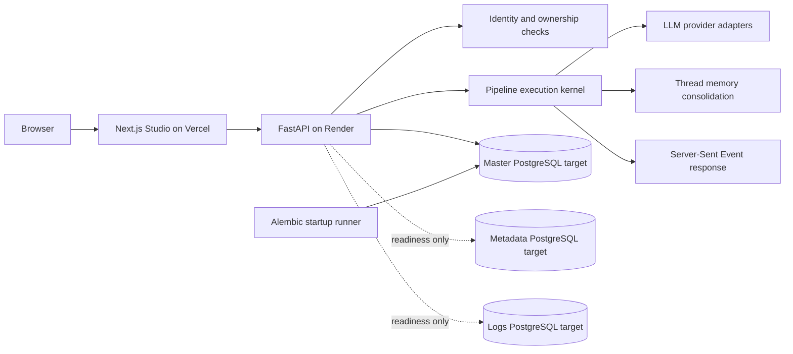

# Fugu System

[](https://github.com/shravanprassadh/fugu-system/actions/workflows/ci.yml)

Fugu System is a private full-stack AI workspace built around authenticated conversation threads, multi-stage model execution, durable thread memory, and administrative control. The current stack uses a FastAPI backend, Next.js Studio frontend, PostgreSQL/Neon persistence, Alembic migrations, and required GitHub Actions validation.

## Deployment

| Layer | Service | Contract |
| --- | --- | --- |
| Frontend | Vercel | Builds `frontend/` and compiles `NEXT_PUBLIC_FUGU_API_BASE_URL` into the application |
| Backend | Render | Runs `backend/entrypoint.sh`, applies migrations, then starts FastAPI/Uvicorn |
| Database | Neon PostgreSQL | Supplies three required connection URLs; current application tables and repositories use the master target |
| CI | GitHub Actions | Blocks merge unless security, backend, frontend, browser, container, and aggregate checks pass |

Detailed deployment instructions are in [`docs/DEPLOYMENT.md`](docs/DEPLOYMENT.md). The enforceable API, migration, schema, and routing baseline is documented in [`docs/BASELINE.md`](docs/BASELINE.md).

## Current capabilities

- Username/password authentication with revocable bearer sessions.
- Strict user ownership for conversation threads and messages.
- Thread creation, rename, deletion, and persisted history.
- Server-Sent Event streaming from the pipeline execution kernel.
- Provider adapters with encrypted credential storage.
- Durable, validated thread-memory consolidation with bounded recent transcript context.
- Administrative controls for users, provider credentials, pipeline steps, database connections, and Render integration.
- Alembic startup migrations protected by a PostgreSQL advisory lock.
- Required production-build browser coverage for the core chat and memory journey.

## Repository layout

```text
.
├── backend/                   # FastAPI application, models, migrations, scripts, tests
├── frontend/                  # Next.js Studio and browser smoke tests
├── docs/                      # Baseline, deployment, and operating contracts
├── .github/workflows/         # Required CI workflow
├── .github/BRANCH_PROTECTION.md
└── .env.example
```

## Architecture



### Database routing reality

Fugu requires these runtime targets:

```text
MASTER_ROUTER_DB_URL
METADATA_SIDEBAR_DB_URL
TRANSACTIONAL_LOGS_DB_URL
```

The current implementation does **not** yet distribute tables across those targets. Users, provider credentials, pipeline definitions, threads, messages, thread memory, pipeline runs, and step traces all use the master session. Metadata and logs are independently pooled and readiness-tested but currently own no application repositories.

Moving data to those targets later is a routing and migration change. Updating environment variables alone is not database migration.

## API

The FastAPI application is:

```text
Title: Fugu Modular Kernel API
Version: 1.0.0
OpenAPI: /api/openapi.json
Swagger UI: /api/docs
```

The backend root `/` is intentionally undefined and may return `404 Not Found`.

Core routes include:

| Method | Route | Purpose |
| --- | --- | --- |
| `GET` | `/api/health/live` | Process liveness |
| `GET` | `/api/health/ready` | Readiness across master, metadata, and logs pools |
| `POST` | `/api/auth/login` | Authenticate and issue a bearer token |
| `GET` | `/api/auth/me` | Restore the authenticated profile |
| `POST` | `/api/auth/logout` | Revoke the user’s active tokens |
| `GET/POST` | `/api/threads` | List or create owned threads |
| `GET` | `/api/threads/{thread_id}/messages` | Load owned thread history |
| `POST` | `/api/threads/{thread_id}/execute` | Execute the pipeline and stream SSE events |
| `GET` | `/api/threads/{thread_id}/memory` | Read durable thread memory |
| `POST` | `/api/threads/{thread_id}/memory/regenerate` | Rebuild memory from the complete thread |

The complete method/path list is committed in [`docs/baseline/system-contract.json`](docs/baseline/system-contract.json) and checked against the generated OpenAPI schema in the backend test suite.

## Migration baseline

The current linear Alembic chain is:

```text
0001_initial_schema
  -> 0002_user_token_version
  -> 0003_pipeline_step_run_identity
  -> 0004_thread_memories
```

Current head:

```text
0004_thread_memories
```

## Required environment variables

### Render

```text
RUNTIME_ENVIRONMENT=production
MASTER_ROUTER_DB_URL=postgresql://...
METADATA_SIDEBAR_DB_URL=postgresql://...
TRANSACTIONAL_LOGS_DB_URL=postgresql://...
SYSTEM_SESSION_SECRET=<at-least-32-characters>
VAULT_ENCRYPTION_KEY=<fernet-key>
ALLOWED_ORIGINS=https://your-vercel-app.vercel.app
RUN_MIGRATIONS=true
VERIFY_DATABASES_ON_STARTUP=true
```

### Vercel

```text
NEXT_PUBLIC_FUGU_API_BASE_URL=https://your-render-backend.onrender.com
```

Do not append `/api`. Redeploy Vercel after changing a public environment variable because Next.js compiles it into the build.

## Local development

### Backend

```bash
cd backend
python -m venv .venv
source .venv/bin/activate
python -m pip install -r requirements.txt
python -m pytest
```

Validation:

```bash
python -m ruff format --check src tests
python -m ruff check src tests
python -m mypy src
python scripts/verify_baseline.py
python -m pip_audit --requirement requirements.txt --strict
```

Public deployment verification:

```bash
python scripts/verify_production.py \
  --frontend-url https://myfugu.vercel.app \
  --backend-url https://fugu-system.onrender.com
```

### Frontend

```bash
cd frontend
npm ci
npm run dev
```

Validation:

```bash
npm run lint
npm test
npm run build
npm run test:e2e
npm audit --audit-level=high
```

## Required CI gate

Every pull request targeting `main` must pass:

- Security & Secret Auditing
- Backend Lint, Type Check, Tests & Audit
- Frontend Lint, Tests, Build & Audit
- Browser End-to-End Smoke Tests
- Production Container & Runtime Validation
- Required CI Gate

The browser journey runs against a production Next.js build and verifies login, protected navigation, thread creation, message submission, SSE completion, persisted memory rebuild, logout, and rejection of the protected route after logout.

The expected GitHub ruleset is documented in [`.github/BRANCH_PROTECTION.md`](.github/BRANCH_PROTECTION.md). Direct pushes to `main` must remain blocked.

## Operational checks

### Backend root returns `404`

Expected. Use:

```text
/api/health/live
/api/health/ready
/api/docs
```

### Login returns `404`

The frontend is probably using the wrong backend origin. Verify `NEXT_PUBLIC_FUGU_API_BASE_URL` and redeploy Vercel.

### Login returns `401`

The backend is reachable, but the credentials are invalid, the user is inactive, or the token has been revoked.

### Alembic reports duplicate tables

The target contains tables without matching Alembic state, or Render is connected to a different Neon branch/database. Verify the exact master target before changing schema state.

### Alembic reports multiple heads

The migration graph has diverged. The repository baseline requires one linear head unless an intentional merge migration is reviewed and recorded.

## Change discipline

1. Branch from `main`.
2. Make the implementation and tests agree.
3. Update the baseline contract when an API or schema change is deliberate.
4. Open a pull request targeting `main`.
5. Merge only after the required aggregate gate succeeds.
6. Run the production verifier after deployment-affecting changes.
