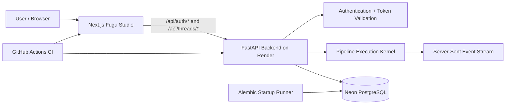

# Fugu System

[](https://github.com/shravanprassadh/fugu-system/actions/workflows/ci.yml)

Fugu System is a modular full-stack prototype for authenticated pipeline execution. It combines a FastAPI backend, a PostgreSQL/Neon data layer, Alembic-managed schema migrations, and a Next.js Studio interface into one deployable system.

The project is designed around a simple operating model: users authenticate, work inside owned conversation threads, submit prompts to an execution pipeline, and receive streamed Server-Sent Events from the backend while the system persists users, threads, messages, provider credentials, pipeline definitions, and run history.

This repository is currently deployment-ready as a prototype. The active cloud path is Vercel for the frontend, Render for the backend, and Neon PostgreSQL for persistence.

## What Fugu includes

- **Authenticated Studio access** using username/password login and bearer tokens.
- **FastAPI backend** with health, auth, and thread execution routes under `/api/...`.
- **Streaming execution endpoint** for prepared pipeline runs over Server-Sent Events.
- **Async PostgreSQL data layer** using SQLAlchemy 2, asyncpg, and explicit database routing.
- **Alembic migrations** applied at backend startup behind a PostgreSQL advisory lock.
- **Neon-compatible URL handling** for `postgresql://`, `postgres://`, and `postgresql+asyncpg://` inputs.
- **Next.js frontend** configured through `NEXT_PUBLIC_FUGU_API_BASE_URL`.
- **Production-oriented CI** covering secret scanning, backend checks, frontend checks, and container validation.

## System architecture



## Repository layout

```text
.
├── backend/                 # FastAPI backend, database models, Alembic migrations, tests
├── frontend/                # Next.js Studio UI
├── docs/                    # Deployment and operating runbooks
├── .github/workflows/       # Required CI gate
└── .env.example             # Environment variable template
```

## Backend API surface

The backend intentionally does **not** expose a root `/` route. Opening the Render backend root URL in a browser may return `404 Not Found`; that does not mean the service is broken.

Use these routes instead:

| Method | Route | Purpose |
| --- | --- | --- |
| `GET` | `/api/health/live` | Process liveness check |
| `GET` | `/api/health/ready` | Database-backed readiness check |
| `GET` | `/api/docs` | Swagger/OpenAPI documentation |
| `POST` | `/api/auth/login` | Username/password login |
| `GET` | `/api/auth/me` | Current authenticated profile |
| `POST` | `/api/auth/logout` | Revoke active tokens for the user |
| `POST` | `/api/threads/{thread_id}/execute` | Execute a thread pipeline and stream SSE events |

## Deployment model

| Layer | Current service | Notes |
| --- | --- | --- |
| Frontend | Vercel | Builds `frontend/`; public API origin is baked into the build |
| Backend | Render | Runs `bash ./entrypoint.sh`; applies migrations before Uvicorn starts |
| Database | Neon PostgreSQL | Used by all runtime pools and Alembic |
| CI/CD | GitHub Actions | Required gate for security, backend, frontend, and container validation |

The deployment contract is documented in detail in [`docs/DEPLOYMENT.md`](docs/DEPLOYMENT.md).

## Critical environment variables

The backend requires three PostgreSQL database URLs, CORS origins, and application secrets. The frontend requires the backend origin.

### Render backend

```text
RUNTIME_ENVIRONMENT=production
MASTER_ROUTER_DB_URL=postgresql://...
METADATA_SIDEBAR_DB_URL=postgresql://...
TRANSACTIONAL_LOGS_DB_URL=postgresql://...
SYSTEM_SESSION_SECRET=<at-least-32-characters>
VAULT_ENCRYPTION_KEY=<fernet-key>
ALLOWED_ORIGINS=https://your-vercel-app.vercel.app
RUN_MIGRATIONS=true
VERIFY_DATABASES_ON_STARTUP=true
```

### Vercel frontend

```text
NEXT_PUBLIC_FUGU_API_BASE_URL=https://your-render-backend.onrender.com
```

Do not append `/api`. The frontend already calls `/api/...` paths internally.

Correct:

```text
https://your-render-backend.onrender.com
```

Incorrect:

```text
https://your-render-backend.onrender.com/api
```

After changing `NEXT_PUBLIC_FUGU_API_BASE_URL`, redeploy the frontend because public Next.js environment variables are compiled into the build.

## First admin user

A fresh database has no default user.

When a backend shell is available, create the first admin with:

```bash
fugu-create-user --username admin --role admin
```

Render Free does not provide a service shell. In that case, use the Neon SQL bootstrap procedure in [`docs/DEPLOYMENT.md`](docs/DEPLOYMENT.md#first-admin-user). Do not commit bootstrap passwords or password hashes to the repository.

## Local development

### Backend

```bash
cd backend
python -m venv .venv
source .venv/bin/activate
python -m pip install -r requirements.txt
python -m pytest
```

Useful backend validation commands:

```bash
python -m ruff format --check src tests
python -m ruff check --fix src tests
python -m mypy src
python -m pip_audit --requirement requirements.txt --strict
```

### Frontend

```bash
cd frontend
npm ci
npm run dev
```

Useful frontend validation commands:

```bash
npm run lint
npm exec vitest -- run
npm audit --audit-level=high
npm run build
```

## CI gate

The required GitHub Actions gate validates:

- repository secret hygiene,
- backend formatting, linting, strict typing, tests, and dependency audit,
- frontend linting, tests, audit, and production build,
- production backend container/runtime behavior.

Do not merge deployment or infrastructure changes unless the required gate is green.

## Common operational checks

### Backend is deployed but browser shows `Not Found`

That is expected for `/`. Test one of these instead:

```text
/api/health/live
/api/health/ready
/api/docs
```

### Login returns `404`

The frontend is probably calling the wrong origin. Check Vercel:

```text
NEXT_PUBLIC_FUGU_API_BASE_URL=https://your-render-backend.onrender.com
```

Then redeploy Vercel.

### Login returns `401`

The backend route is reachable, but the credentials are invalid or the user is inactive.

### Alembic reports duplicate tables

The database contains application tables without matching Alembic version state, or Render is connected to a different Neon branch/database than the one that was reset. Confirm `MASTER_ROUTER_DB_URL` and inspect the exact database used by Render.

### Alembic reports multiple heads

The migration graph has diverged. Keep the migration chain linear unless you intentionally create an Alembic merge migration.

## Current project state

- PR #18 was closed unmerged because it became stale and non-mergeable.
- PR #19 replaced it and landed the active startup-timeout fix on `main`.
- The current documentation reflects the Render/Vercel/Neon deployment path and the PostgreSQL-only migration runtime.
